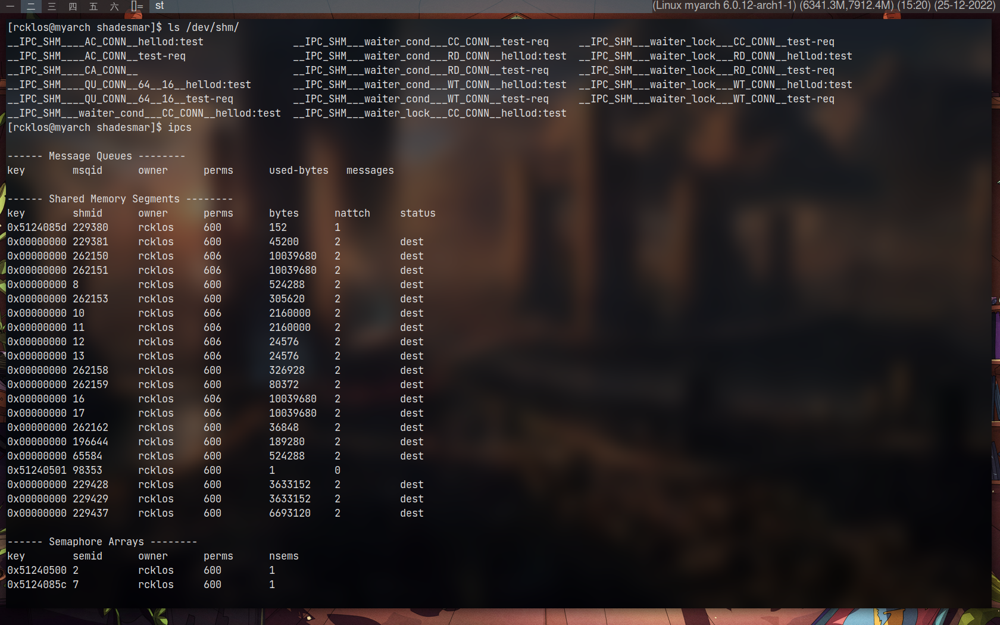
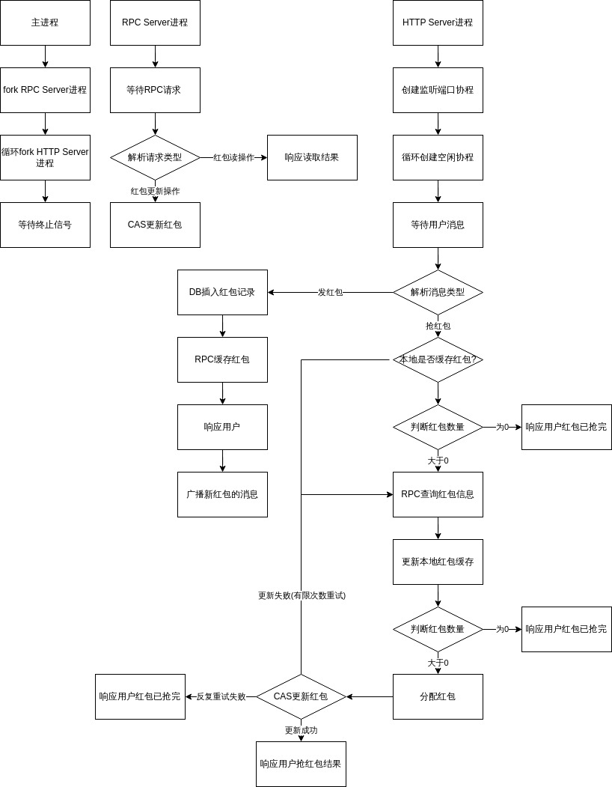

## 抢红包

[TOC]

## 问题

1. 在游戏中，玩家A向全服玩家发送红包，其他玩家可以通过“抢红包”的操作来获得红包中的部分奖励，每个红包会被10个玩家瓜分。

2. 尝试思考，当有1000名玩家几乎同时发起“抢红包”操作时，如何保证每个玩家的操作延时在 10ms以下？

## 红包随机算法思路

### 随机分配红包剩余金额

最简单的随机实现方法，玩家每次打开红包都会随机分配红包剩余的金额。


> 剩余金额随机分配很容易导致前几个抢到红包的用户就是收起最佳的，而后续的用户打开红包甚至只能拿到"低保"金额，故需改进

### 二倍均值法

二倍均值法理论上保证了每次拆红包时所获得的金额范围都是相等的，而不会因为拆包的先后顺序而导致随机范围越来越小。


#### 二倍均值法实现关键代码

```c++
// 随机数生成引擎
random_device rd{};
mt19937 engine{rd()};
// 随机数分布范围
uniform_real_distribution<double> dist{0.0, 1.0};
// 取随机数
double random_number_between_0_and_1 = dist(engine);
// 保底0.01
double cal = 0.01 + ceil(100 * (random_number_between_0_and_1 * (2 * (remain_money / remain_num) - 0.01))) / 100;
```

## 发抢红包流程思路

### 基本流程


### 单线程简单发派模拟

核心代码: 

```c++
// 剩余金额
double remain_money = money;
// 分发人数
int num = diliver_num;
// 模拟抢红包
for(int i = num; i > 0; i--) {
  double money = std::calculate_one_paper_by_double_mean(remain_money, i);
  remain_money -= money;
  printf("play[%02d]抢到红包[%.2lf]\n", i, money);
}
```

> 该段代码直观地展现了流程图的基本思路实现，但该程序简化了实际上的各种复杂环境，尤其是在性能模拟以及在高并发的情况下如何发派等情况上并不能够模拟实际的流程，故需在此基础上继续实现。

### 多线程的并发模拟

核心代码：

```c++
// 红包对象
RedPaper rp(money, num);
for(int i = 1000; i > 0; i--) {
  // 新建线程去执行抢红包的动作(grab)
  std::thread t(&RedPaper::grab, &rp);
}
```


> 多线程相较于单线程能够模拟到服务器接受多个用户并发的抢红包请求，但由于这段程序的模拟中，对每一个用户的请求都会新建一个线程去处理，结果是：
> 
> 每次抢红包的操作(grab)都不超过2ms，而循环新建线程的时间却占用了几十毫秒，假设所有请求几乎都是同时到达，那么最后一个被处理的请求可能就需要等待几十毫秒才能执行抢红包的逻辑。
>
> 故需要在线程的问题上进一步优化

### 线程池的并发模拟

核心代码:

```c++
// 线程池中预设8个工作线程
ThreadPool pool(8);
pool.init();

// 模拟路由1000次请求
for(int i = 1000; i > 0; i--) {
  // 往线程池提交抢红包的操作
  auto f = pool.submit(func_grab);
}
```


## 高并发策略优化

### 协程与线程池

通过上述的实验可以验证线程池相较于重复新建线程更为高效，但在实际应用中，线程池往往会因为时间片的耗尽而导致触发上下文的切换。

当一个线程持有抢红包的唯一锁且未完成金额分配时恰好时间片耗尽而切换上下文，最差的情况下会导致线程池内所有线程空转了一圈而消耗了相应的时间。

第二种情况则是假设用户存在一些其他的IO操作或者锁竞争时，则会有一部分包括时间在内的的资源开销，这也是线程池无法避免的地方。

综上，若能够控制当前所执行的任务在合适的时候主动让出CPU运算资源，可能可以更好的去优化高并发的接待能力。

#### QPS验证

在单机四核的Linux上进行QPS验证：

> 基于协程自己开发的`FishWebServer`和基于线程池开发的`TinyWebServer`的QPS比较
> 
> 两种服务器业务逻辑基本相同，并且两种服务器的工作线程数量相等。
> 
> 以下图示中，横轴为每秒并发量，纵轴表示QPS


从图中可以看出，当并发量10k时，协程的接待能力甚至是线程池的两倍。

因此选择采用协程的方案来开发服务器，采用协程开发的另外一个好处则是，用户可以使用同步的代码来写异步逻辑程序，这能够极大的简化用户程序逻辑以及提升代码的阅读性。

### 并发模型下数据的缓存

在玩家瓜分红包时，在高并发方面上优化时延的同时，数据一致性更为重要。要同时保证高并发的能力和数据一致性，则需在程序持久化之前加上一层高速缓存策略。

目前主流采用redis缓存，但要求不使用中间件的情况下，最初的想法是开发出一个工具lib将内存映射成`key-value`形式，从而再此基础上进行开发，但是在没有一个具有访问控制的仲裁者的情况下，映射的内存很容易出现脏数据的问题。

故需要自己开发一个缓存管理的进程，这样便只需要抽象设计IPC通信的协议，即可在缓存管理进程中存取数据，进程间的通信(IPC)方式主要考虑以下两种形式：

- 通过内存映射实现
- 基于socket实现

基于内存映射的IPC实现可以采用`shm`进行开发，`shm`将数据保存在主存中，理论上在单机上延时是最低的，但在开发的过程中也逐渐暴露出许多问题：

1. 只允许单机实现，如果在分布式场景下，需要额外开发一些程序进行辅助，但会导致性能大打折扣。
2. 由于内存映射是由内核管理的，故进程之间无法感知对方的存在或者不存在，需要写类似于tcp心跳包的功能去实现。
3. Linux会在最后一个关联映射内存的进程退出时，通知其回收映射内存，但该进程如果是中途崩溃退出，则会导致`/dev/shm`存在未回收的映射内存(如下图)，目前较快的解决方法则是重启计算机或者`rm /dev/shm/*`



历经了两天的内存映射的尝试之后，最终的开发方案选择socket实现(囧)，由于此时已经开始感冒发烧，为了加快开发进度，决定不再造轮子，而选型现有的框架进行开发。

最切合需求的是RPC框架，下图是`Apache brpc`提供的rpc性能测试结果:


图中百度的brpc有着"一览众山小"的感觉，但后续推出的`rest_rpc`在性能上相较brpc更优。

> 以下图示横轴是client线程数，纵轴是QPS


故选用`rest_rpc`作为接下来开发的基础rpc库进行开发。

#### RPC缓存测试

服务器整合RPC缓存进程的性能测试


1秒内发送1k个请求，并且每次都反问一次缓存，得到平均时延是`1.12ms`，最高`2.78ms`。


#### 设计完整程序流程



> 说明： 以上图示中均无线程操作，RPC进程和TCP进程都是单线程的。
> 
> 在TCP进程中，可能会存在着一个协程在获取红包数据后被其他协程抢占CPU并修改红包而造成脏数据，故上锁后程序会再更新一次红包数据，确保不会操作到脏数据。

编码实现(抢红包): 

```c++
servlet_dispatch->SetServlet("/grab", [&](HttpRequest::Ptr req, HttpResponse::Ptr rsp, HttpSession::Ptr session){
    // 预设抢不到红包的结果
    snprintf(str, 200, "red paper is over!\n");
    // 读取红包数据
    red_paper_t rp = cli.call<red_paper_t>("query");
    // 如果红包还有名额则进去分配红包
    if(rp.num > 0) {
        // 等待成功上锁
        while(!cli.call<bool>("lock"));
        // 再次更新红包数据，防止脏数据
        rp = cli.call<red_paper_t>("query");
        // 再次判断才确认拆包
        if(rp.num > 0) {
            // 二倍均值法计算抢到的数额
            double cal = std::calculate_one_paper_by_double_mean(rp.money, rp.num);
            // 更新缓存
            if(cli.call<bool>("grab", cal))
                snprintf(str, 200, "grab money: %.2lf\n", rp.money);
        }
        std::cout << str;
        // 解锁
        cli.call<void>("unlock");
    }
    // 响应结果
    rsp->SetBody(str);
    return 0;
});
```

测试结果：

> 身体原因暂未实现发红包的功能，只对抢单个红包进行模拟


令人振奋的是： 1s内发送了1k个抢红包请求的测试结果最大时延`6.84ms`，而平均时延仅`1.25ms`。

### 数据持久化的方案

目前数据都只是在内存中操作，持久化方案考虑如下：

在缓存进程中新建子线程，父子线程通过线程安全的消息队列通信，形成生产者-消费者模式。父线程在接收红包数据缓存时，会先执行用户的操作，后提交一次操作记录到队列中，供予子线程消费。子线程获取到一个新的操作记录，会根据其内容进行更新数据库。

`生产者-消费者`模式可以是一对多的关系，多个子线程竞争消费队列中的消息，从而提高性能。

这种方案也可以继续以`生产者-消费者`的模式应用于进程的IPC通信中，供予多个进程消费。

### 基于长连接的优化方案

一个玩家能够向全服玩家发送红包，并让各位玩家瓜分，则需要服务器有主动推送消息给游戏客户端的能力，则离不开TCP长连接的支持。

则在基于长连接的即时消息推送的方案上，可以在通信协议上进行优化，从而实现在信息量不变的情况下减少IO的数据量，则可以一定程度上减少玩家操作的延时。

当前基础上开发使用的是http，自定义tcp的方案若后续有时间，可以继续优化程序结构。

## 总结

综合上文所讨论的优化方案，主要有几点:

1. 应用协程作为服务器开发基础。
2. 独立进程在高并发的情况下将数据缓存在内存中
3. IPC方案最终选择使用基于socket的RPC库

整个系统考虑的都是进程，主要考虑的是进程之间相互独立，系统可以无需修改业务逻辑，而能够更好的拓展部署在分布式环境中。

理论上主要围绕着资源复用、IO优化、并发资源竞争三个方面进行讨论，在实践验证中成长，此次过程中收获颇丰。整套程序后续还有许多待改进的地方。
